# KalaOS
An authored operating system that unfolds as a profile experience.

## ORIGIN
<picture>
  <source media="(prefers-color-scheme: dark)" srcset="./assets/generated/origin-dark.svg">
  <source media="(prefers-color-scheme: light)" srcset="./assets/generated/origin-light.svg">
  
</picture>

## BOOT
<picture>
  <source media="(prefers-color-scheme: dark)" srcset="./assets/generated/boot-dark.svg">
  <source media="(prefers-color-scheme: light)" srcset="./assets/generated/boot-light.svg">
  
</picture>

## IDENTITY
<picture>
  <source media="(prefers-color-scheme: dark)" srcset="./assets/generated/identity-dark.svg">
  <source media="(prefers-color-scheme: light)" srcset="./assets/generated/identity-light.svg">
  
</picture>

## SYSTEMS
<picture>
  <source media="(prefers-color-scheme: dark)" srcset="./assets/generated/systems-dark.svg">
  <source media="(prefers-color-scheme: light)" srcset="./assets/generated/systems-light.svg">
  
</picture>

## TELEMETRY
<picture>
  <source media="(prefers-color-scheme: dark)" srcset="./assets/generated/telemetry-dark.svg">
  <source media="(prefers-color-scheme: light)" srcset="./assets/generated/telemetry-light.svg">
  
</picture>

## CHRONOLOGY
<picture>
  <source media="(prefers-color-scheme: dark)" srcset="./assets/generated/chronology-dark.svg">
  <source media="(prefers-color-scheme: light)" srcset="./assets/generated/chronology-light.svg">
  
</picture>

## SIGNALS
<picture>
  <source media="(prefers-color-scheme: dark)" srcset="./assets/generated/signals-dark.svg">
  <source media="(prefers-color-scheme: light)" srcset="./assets/generated/signals-light.svg">
  
</picture>

## INTERFACE
<picture>
  <source media="(prefers-color-scheme: dark)" srcset="./assets/generated/interface-dark.svg">
  <source media="(prefers-color-scheme: light)" srcset="./assets/generated/interface-light.svg">
  
</picture>

## HANDOFF
<picture>
  <source media="(prefers-color-scheme: dark)" srcset="./assets/generated/handoff-dark.svg">
  <source media="(prefers-color-scheme: light)" srcset="./assets/generated/handoff-light.svg">
  
</picture>
