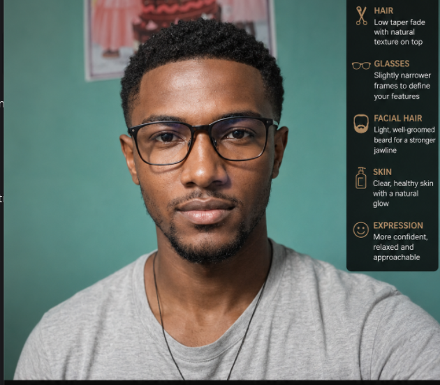

  

  <a href="mailto:alebachewkalaab99@gmail.com">alebachewkalaab99@gmail.com</a> |
  <a href="https://drive.google.com/file/d/1FERJp1rDrOfLZB6k7w06ezcif2H9GhWb/view?usp=drive_link">Resume</a> |
  <a href="https://instagram.com/kalaabalb">Instagram</a> |
  <a href="https://et.linkedin.com/in/kalaab-alb">LinkedIn</a>

  
  
  

## About

Frontend and backend developer building clean web, mobile, and platform experiences.

- Flutter and Dart for mobile apps
- React for frontend work
- Node.js APIs with SQL and NoSQL data layers
- Firebase, Linux, Git, Bash, and Docker in the workflow

## Featured Projects

<table>
  <tr>
    <td width="50%" valign="top">
      <a href="https://github.com/kalaabalb/familyacademy.et"><b>familyacademy.et</b></a> 
      Cinematic public landing page and download hub. 
      Brand, SEO, downloads
    </td>
    <td width="50%" valign="top">
      <a href="https://github.com/kalaabalb/family-academy-client"><b>family-academy-client</b></a> 
      Client app for the Family Academy ecosystem. 
      Product app, user flow
    </td>
  </tr>
  <tr>
    <td width="50%" valign="top">
      <a href="https://github.com/kalaabalb/ecommerce-backend-api"><b>ecommerce-backend-api</b></a> 
      Backend API for the e-commerce system. 
      JavaScript, APIs, data flow
    </td>
    <td width="50%" valign="top">
      <a href="https://github.com/kalaabalb/e-commerce-app"><b>e-commerce-app</b></a> 
      Flutter commerce app with a public footprint. 
      Flutter, mobile UI, product flow
    </td>
  </tr>
  <tr>
    <td width="50%" valign="top">
      <a href="https://github.com/kalaabalb/force"><b>force</b></a> 
      School management system for grading workflows. 
      Java, student and teacher views
    </td>
    <td width="50%" valign="top">
      <a href="https://github.com/kalaabalb/yomoblies"><b>yomoblies</b></a> 
      Dart project with active recent development. 
      Dart, mobile work
    </td>
  </tr>
</table>

## Stack

`React` `Flutter` `Dart` `Node.js` `Express` `Firebase` `MongoDB` `MySQL` `PostgreSQL` `Git` `Linux` `Docker`

## Current Work

- Shipping Flutter apps and backend services
- Keeping designs clean, direct, and usable
- Building products that work across web and mobile

## Connect

- GitHub: `@kalaabalb`
- Instagram: [kalaabalb](https://instagram.com/kalaabalb)
- LinkedIn: [kalaab-alb](https://et.linkedin.com/in/kalaab-alb)
- LeetCode: [kalaabalex](https://www.leetcode.com/kalaabalex)

## Stats

  
  

