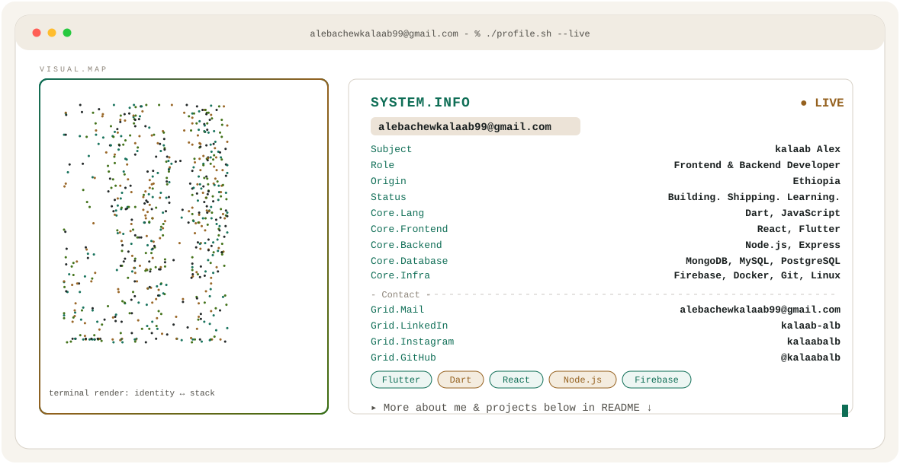

<!-- ===== THEME-AWARE HERO BANNER ===== -->
<!-- GitHub automatically shows dark.svg in dark mode and light.svg in light mode -->

<picture>
  <source media="(prefers-color-scheme: dark)" srcset="./dark.svg">
  <source media="(prefers-color-scheme: light)" srcset="./light.svg">
  
</picture>

<!-- ===== GITHUB STATS ===== -->

<!-- Streak — full width -->
<picture>
  <source media="(prefers-color-scheme: dark)" srcset="https://streak-stats.demolab.com/?user=kalaabalb&hide_border=true&background=0a1817&stroke=54b7b2&ring=d39a52&fire=8fc97f&currStreakLabel=54b7b2&sideLabels=c7d0cc&currStreakNum=f4efe7&sideNums=f4efe7&dates=7f8d89&titleColor=54b7b2&card_width=1180" />
  
</picture>

 

<!-- Stats + Top languages — side by side -->
<picture>
  <source media="(prefers-color-scheme: dark)" srcset="https://raw.githubusercontent.com/kalaabalb/kalaabalb/stats/stats-dark.svg" />
  
</picture>
<picture>
  <source media="(prefers-color-scheme: dark)" srcset="https://raw.githubusercontent.com/kalaabalb/kalaabalb/stats/langs-dark.svg" />
  
</picture>

<!-- ===== CONTRIBUTION SNAKE ===== -->

<picture>
  <source media="(prefers-color-scheme: dark)" srcset="https://raw.githubusercontent.com/kalaabalb/kalaabalb/output/snake-dark.svg" />
  <source media="(prefers-color-scheme: light)" srcset="https://raw.githubusercontent.com/kalaabalb/kalaabalb/output/snake-light.svg" />
  
</picture>

<!-- ===== END SNAKE ===== -->
 
 

<picture>
  <source media="(prefers-color-scheme: dark)" srcset="https://raw.githubusercontent.com/kalaabalb/kalaabalb/projects/projects.svg" />
  <source media="(prefers-color-scheme: light)" srcset="https://raw.githubusercontent.com/kalaabalb/kalaabalb/projects/projects-light.svg" />
  
</picture>

<!-- ===== SOCIAL BADGES ===== -->
 

&nbsp;&nbsp;

&nbsp;&nbsp;

&nbsp;&nbsp;

&nbsp;&nbsp;

<!-- ===== END SOCIAL BADGES ===== -->

<!-- =================================== -->
