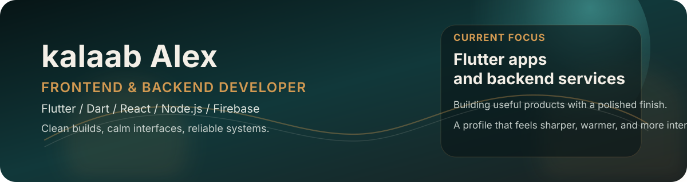

  

<table>
  <tr>
    <td valign="top" width="56%">
      

        
      

    </td>
    <td valign="top" width="44%">
      <h3>Identity Card</h3>

      
<b>kalaab Alex</b> 
      Frontend &amp; Backend Developer 
      Ethiopia

      

        Calm interfaces. Clean systems. Practical shipping.
      

      <table>
        <tr>
          <td><b>Hair</b> Low taper fade with natural texture on top</td>
        </tr>
        <tr>
          <td><b>Glasses</b> Slightly narrower frames to define the features</td>
        </tr>
        <tr>
          <td><b>Facial Hair</b> Light, well-groomed beard for a stronger jawline</td>
        </tr>
        <tr>
          <td><b>Skin</b> Clear, healthy skin with a natural glow</td>
        </tr>
        <tr>
          <td><b>Expression</b> Confident, relaxed, and approachable</td>
        </tr>
      </table>
    </td>
  </tr>
</table>

  <a href="mailto:alebachewkalaab99@gmail.com">alebachewkalaab99@gmail.com</a> |
  <a href="https://drive.google.com/file/d/1FERJp1rDrOfLZB6k7w06ezcif2H9GhWb/view?usp=drive_link">Resume</a> |
  <a href="https://instagram.com/kalaabalb">Instagram</a> |
  <a href="https://et.linkedin.com/in/kalaab-alb">LinkedIn</a>

  
  
  

<table>
  <tr>
    <td valign="top" width="50%">
      <h3>About</h3>

      
I build clean product experiences across web, mobile, and backend systems.

      <ul>
        <li>Frontend work with HTML, CSS, JavaScript, and React</li>
        <li>Flutter and Dart apps for mobile delivery</li>
        <li>Node.js APIs with SQL and NoSQL data layers</li>
        <li>Firebase for auth, storage, and app services</li>
      </ul>
    </td>
    <td valign="top" width="50%">
      <h3>Featured Projects</h3>

      <table>
        <tr>
          <td>
            <a href="https://github.com/kalaabalb/familyacademy.et"><b>familyacademy.et</b></a> 
            Cinematic public landing page and download hub. 
            Brand, SEO, downloads
          </td>
          <td>
            <a href="https://github.com/kalaabalb/family-academy-client"><b>family-academy-client</b></a> 
            Client app for the Family Academy ecosystem. 
            Product app, user flow
          </td>
        </tr>
        <tr>
          <td>
            <a href="https://github.com/kalaabalb/ecommerce-backend-api"><b>ecommerce-backend-api</b></a> 
            Backend API for the e-commerce system. 
            JavaScript, APIs, data flow
          </td>
          <td>
            <a href="https://github.com/kalaabalb/e-commerce-app"><b>e-commerce-app</b></a> 
            Flutter commerce app with a public footprint. 
            Flutter, mobile UI, product flow
          </td>
        </tr>
        <tr>
          <td>
            <a href="https://github.com/kalaabalb/force"><b>force</b></a> 
            School management system for grading workflows. 
            Java, student and teacher views
          </td>
          <td>
            <a href="https://github.com/kalaabalb/yomoblies"><b>yomoblies</b></a> 
            Dart project with active recent development. 
            Dart, mobile work
          </td>
        </tr>
      </table>

      <h3>Quick facts</h3>

      <ul>
        <li>Role: Frontend &amp; Backend Developer</li>
        <li>Stack: Flutter, Dart, React, Node.js, Firebase</li>
        <li>Languages: Java, C++, JavaScript, SQL</li>
        <li>Location: Ethiopia</li>
      </ul>
    </td>
  </tr>
</table>

## Stack

`React` `Flutter` `Dart` `Node.js` `Express` `Firebase` `MongoDB` `MySQL` `PostgreSQL` `Git` `Linux` `Docker`

## Current Work

- Shipping Flutter apps and backend services
- Keeping designs clean, direct, and usable
- Building products that work across web and mobile

## Connect

- GitHub: `@kalaabalb`
- Instagram: [kalaabalb](https://instagram.com/kalaabalb)
- LinkedIn: [kalaab-alb](https://et.linkedin.com/in/kalaab-alb)
- LeetCode: [kalaabalex](https://www.leetcode.com/kalaabalex)

## Stats

  
  

